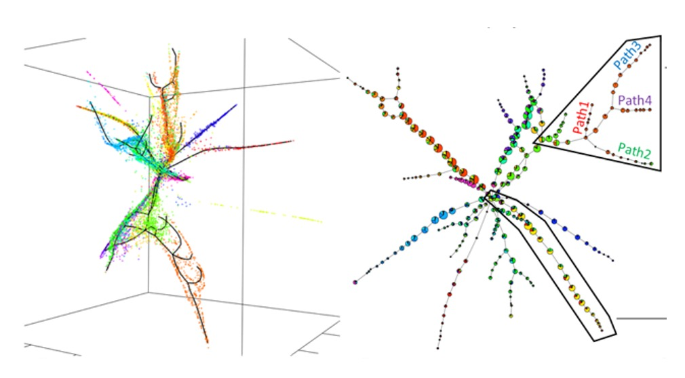

# ElPiGraph

ElPiGraph (Elastic Principal Graph) is a method for approximating datasets with complex topologies.

This directory contains codes, example datasets, and analyses centered on the application of ElPiGraph to different types of data.

## Datasets

## Code

## Notebooks (containing code and figures)

[Branching pseudotime reconstruction from Nestorowa et la. with MLLE](roscoff_sct_nesto_mlle/index.html)

[Branching pseudotime reconstruction from Nestorowa et la. with PCA](roscoff_sct_nesto_pca/index.html)

[Linear pseudotime reconstruction from Schlitzer et la. with MLLE and PCA](roscoff_sct_schli_mlle_pca/index.html)

## Figures

[3D Force directed layout derived for xenopus stage 22 embryos](xeno_k5_fd/index.html) - Interactive figure (see Albergante et al, 2018 for details)

[3D Force directed layout with the fitted consensus graph for xenopus stage 22 embryos](xeno_k5_consensus/index.html) - Interactive figure (see Albergante et al, 2018 for details)

## ElPiGraph implementations (from most to least complete)

[ElPiGraph.R](https://github.com/sysbio-curie/ElPiGraph.R) - implementation of ElPiGraph in R (most complete functionality and multi-core support)

[ElPiGraph.P](https://github.com/j-bac/elpigraph-python) - implementation of ElPiGraph in Python (Equivalent to R version, multi-core and GPU support. Missing some of the plotting functionalities)

[ElPiGraph.M](https://github.com/sysbio-curie/ElPiGraph.M) - implementation of ElPiGraph in MATLAB (Less options than Python and R version)

[ElPiGraph.Java](https://github.com/auranic/VDAOEngine/) - implementation of ElPiGraph as part of the VDAO engine

[ElPiGraph.Scala](https://github.com/mraad/elastic-graph) - implementation of ElPiGraph in Scala

## References

[Albergante et al, Robust and scalable learning of data manifolds with complex topologies via ElPiGraph, 2018, preprint](https://arxiv.org/abs/1804.07580)

## Contact

[Jonathan Bac](https://github.com/j-bac)

[Luca Albergante](https://github.com/Albluca)

[Andrei Zinovyev](https://auranic.github.io)

